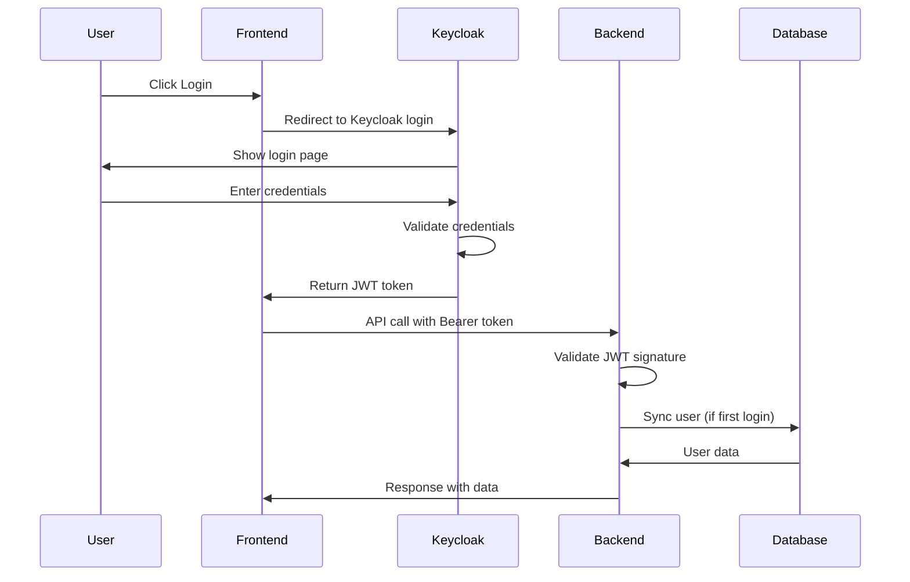
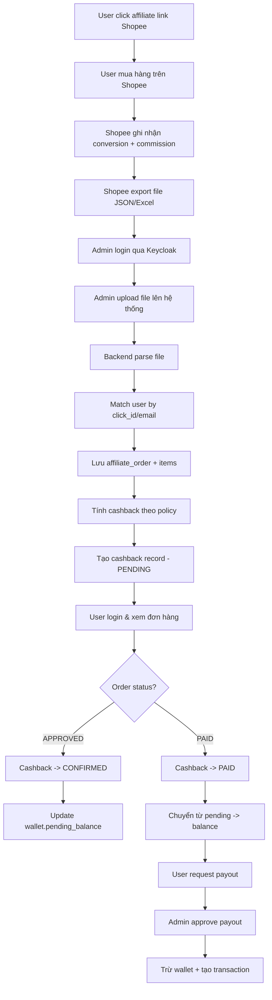

# Cashbee BackEnd

---

# 📘 CASHBEE – MVP FUNCTIONAL SPECIFICATION DOCUMENT

**Version:** 2.0 (Keycloak Integrated)

**Date:** 2025-10-29

**Prepared by:** Business Analyst Team (CashBee Project)

**Audience:** DEV Team (BE/FE), QA/Test Team

**⚠️ IMPORTANT CHANGES IN v2.0:**
- Authentication & Authorization fully managed by **Keycloak**
- OAuth2/OIDC flow with JWT tokens
- PEP (Policy Enforcement Point) for authorization
- User data synced from Keycloak to local DB for business purposes only

---

## 🧭 1. MỤC TIÊU DỰ ÁN (Project Objective)

CashBee là nền tảng **hoàn tiền (cashback)** cho người dùng mua hàng qua liên kết tiếp thị liên kết (Affiliate Link).

Trong giai đoạn **MVP (Minimum Viable Product)**, mục tiêu là:

- **Xác thực & phân quyền qua Keycloak**: OAuth2/OIDC với JWT tokens
- **Người dùng đăng ký/đăng nhập qua Keycloak**, dữ liệu được đồng bộ về hệ thống
- Quản trị viên có thể **import dữ liệu đơn hàng từ file JSON/Excel** (Shopee Affiliate Export)
- Hệ thống **tự động tính hoàn tiền** dựa trên hoa hồng thực tế từ đơn hàng theo policy
- Người dùng có thể **xem số dư ví**, **yêu cầu rút tiền**, và **xem lịch sử giao dịch**
- **Audit log đầy đủ** cho mọi thao tác admin

---

## ⚙️ 2. PHẠM VI MVP (Scope)

| Nhóm chức năng | Mô tả ngắn |
| --- | --- |
| 🔐 **Keycloak Integration** | OAuth2/OIDC authentication, PEP authorization, User sync |
| 👤 **User Management** | Đồng bộ user từ Keycloak, cập nhật profile & payment info |
| 🌐 **Affiliate Order Import** | Admin upload file Shopee (JSON/Excel) → parse & save orders |
| 💰 **Cashback Calculation** | Tự động tính cashback theo policy, update wallet |
| 🏦 **User Wallet & Transaction** | Quản lý số dư (available/pending/locked), lịch sử giao dịch |
| 📊 **Dashboard (User)** | Xem đơn hàng, cashback status, wallet balance |
| 🔐 **Admin Portal** | Upload file, approve payout, view statistics, audit logs |
| 📝 **Audit & Logging** | Track tất cả admin actions, structured logging |

---

## 🧠 3. CHI TIẾT CHỨC NĂNG (FUNCTIONAL REQUIREMENTS)

### 3.0. KEYCLOAK INTEGRATION MODULE

### 3.0.1. Authentication Flow (OAuth2/OIDC)

- **Actor:** User (via Frontend)
- **Mô tả:** Frontend redirect user to Keycloak for authentication
- **Flow:**
    1. User click "Login" → Frontend redirect to Keycloak login page
    2. User nhập credentials trên Keycloak
    3. Keycloak validates & issues **JWT Access Token** + **Refresh Token**
    4. Frontend nhận token và gọi Backend API với **Bearer Token**
    5. Backend validates JWT signature & claims
    6. Backend extracts `sub` (keycloak_id), `preferred_username`, `email`, `roles`
    7. Backend syncs user to local DB nếu chưa tồn tại
    8. Backend processes business logic

**⚠️ Backend KHÔNG handle login/register logic - Keycloak manages all authentication**

---

### 3.0.2. Authorization (PEP Model)

- **Mô tả:** Sử dụng Keycloak Policy Enforcement Point
- **Roles:**
    - `USER`: Normal user (view orders, request payout)
    - `ADMIN`: Admin user (import files, approve payout, view stats)
- **Implementation:**
    - Spring Security với Keycloak Adapter
    - Resource Server validates JWT token
    - `@PreAuthorize("hasRole('ADMIN')")` cho admin endpoints
    - `@PreAuthorize("hasRole('USER')")` cho user endpoints

---

### 3.1. USER MODULE

### 3.1.1. User Sync from Keycloak

- **Trigger:** Khi user login lần đầu hoặc gọi API
- **Mô tả:** Tự động đồng bộ thông tin user từ Keycloak về local DB
- **Input:** JWT token claims (sub, email, username, name)
- **Logic:**
    1. Extract `keycloak_id` từ JWT token (`sub` claim)
    2. Check user tồn tại trong DB bằng `keycloak_id`
    3. Nếu không tồn tại:
        - Tạo mới user với `keycloak_id`, `email`, `username`, `full_name`
        - Tạo `user_wallet` với balance = 0
        - Tạo `user_profile` với default values
        - Generate `referral_code`
    4. Nếu tồn tại:
        - Update `last_login_at`
        - Update `last_sync_at`
        - Update email/username nếu thay đổi

**⚠️ KHÔNG lưu password - Keycloak manages passwords**

---

### 3.1.2. Xem thông tin cá nhân

- **Actor:** User
- **Endpoint:** `GET /api/v1/profile`
- **Authorization:** `hasRole('USER')`
- **Output:**
    - Basic info: email, username, full_name, phone, referral_code
    - Wallet: balance, pending_balance, total_earned
    - Profile: payment accounts (momo, zalopay, bank)

---

### 3.1.3. Cập nhật thông tin cá nhân

- **Actor:** User
- **Endpoint:** `PUT /api/v1/profile`
- **Authorization:** `hasRole('USER')`
- **Input:**
    - full_name, phone, address, date_of_birth
    - Payment info: momo_number, momo_name, zalopay_number, bank_account, etc.
- **Validation:**
    - Phone: Vietnamese format (10-11 digits, starts with 0)
    - Momo/ZaloPay: 10 digits
    - Bank account: 8-20 digits
- **Flow:**
    1. Validate input
    2. Update `user_profile` table
    3. Return updated profile

**⚠️ KHÔNG cho phép update email/username - phải update trên Keycloak**

---

### 3.2. AFFILIATE MODULE

### 3.2.1. Import File Shopee (JSON/Excel)

- **Actor:** Admin
- **Input:** File Excel hoặc JSON chứa danh sách conversion.
- **Output:** Bản ghi trong bảng `affiliate_import_batch`, `affiliate_order`, `affiliate_order_item`.
- **Logic:**
    1. Upload file → hệ thống parse bằng Apache POI / Jackson.
    2. Map các field (`order_sn`, `click_id`, `commission_amount`, `item_name`, …).
    3. Nếu `order_id` đã tồn tại → cập nhật trạng thái & hoa hồng.
    4. Nếu mới → insert vào `affiliate_order` + `affiliate_order_item`.
    5. Tính `cashback_amount = commission_amount × cashback_rate` (theo `cashback_policy`).
    6. Cập nhật `cashback` ở trạng thái `PENDING`.

---

### 3.2.2. Xem danh sách đơn hàng

- **Actor:** User
- **Hiển thị:** order_id, shop_name, sản phẩm, hoa hồng, trạng thái hoàn tiền.
- **Lọc:** theo trạng thái (Pending / Confirmed / Paid).
- **Flow:**
    1. User login → gọi API `/api/orders/my`.
    2. BE join bảng `affiliate_order` + `cashback`.
    3. Trả danh sách kèm thông tin hoàn tiền.

---

### 3.2.3. Tính toán hoàn tiền tự động

- **Trigger:** Khi import batch mới hoặc khi order chuyển sang trạng thái `PAID`.
- **Logic:**
    - Lấy tỷ lệ hoàn tiền từ `cashback_policy`.
    - `cashback_amount = commission_amount × rate`.
    - Cập nhật bảng `cashback.status = CONFIRMED`.
    - Tăng `user_wallet.balance`.
    - Ghi log vào `wallet_transaction`.

---

### 3.3. WALLET MODULE

### 3.3.1. Xem số dư ví

- **Actor:** User
- **Output:** total_balance, pending_balance, locked_balance
- **Source:** bảng `user_wallet`

---

### 3.3.2. Lịch sử giao dịch

- **Actor:** User
- **Hiển thị:** loại giao dịch (Cashback, Withdraw, Bonus...), số tiền, ngày tạo, trạng thái.
- **Source:** bảng `wallet_transaction`

---

### 3.3.3. Yêu cầu rút tiền

- **Actor:** User
- **Điều kiện:** `balance >= min_withdraw` (vd. 20.000₫)
- **Flow:**
    1. User chọn phương thức (Momo, ZaloPay, Bank).
    2. Hệ thống tạo bản ghi `payout_request` với `status = REQUESTED`.
    3. Admin xử lý thủ công → cập nhật sang `PAID`.
    4. Khi `PAID` → trừ số dư & ghi `wallet_transaction`.

---

### 3.4. ADMIN MODULE

### 3.4.1. Quản lý import batch

- **Actor:** Admin
- **Hiển thị:** file_name, imported_at, total_orders, status
- **Action:** Xem chi tiết → Xem danh sách order thuộc batch.

---

### 3.4.2. Dashboard thống kê

- **Dữ liệu hiển thị:**
    - Tổng số user
    - Tổng số đơn hàng import
    - Tổng hoa hồng / tổng cashback
    - Tổng tiền rút / đang chờ rút

---

### 3.4.3. Quản lý yêu cầu rút tiền

- **Actor:** Admin
- **Endpoint:** `GET /api/v1/admin/payouts`, `PUT /api/v1/admin/payouts/{id}/approve`
- **Authorization:** `hasRole('ADMIN')`
- **Chức năng:** Xem danh sách yêu cầu → approve/reject payout
- **Flow:**
    1. Admin xem danh sách payout requests (filter by status)
    2. Admin chọn request và approve/reject
    3. Nếu approve:
        - Cập nhật `payout_request.status = PAID`
        - Trừ ví user: `wallet.balance -= payout.amount`
        - Tạo `wallet_transaction` (type=WITHDRAW, amount=negative)
        - Log audit: `APPROVE_PAYOUT`
    4. Nếu reject:
        - Cập nhật `payout_request.status = REJECTED`
        - Unlock locked balance: `wallet.locked_balance -= payout.amount`
        - Log audit: `REJECT_PAYOUT`

---

### 3.4.4. Audit Log

- **Actor:** Admin
- **Endpoint:** `GET /api/v1/admin/audit-logs`
- **Authorization:** `hasRole('ADMIN')`
- **Mô tả:** Xem lịch sử tất cả thao tác admin
- **Tracked Actions:**
    - `IMPORT_FILE`: Upload & parse affiliate file
    - `APPROVE_PAYOUT`: Approve payout request
    - `REJECT_PAYOUT`: Reject payout request
    - `UPDATE_CONFIG`: Change system config
    - `BAN_USER`: Ban user account
    - `ADJUST_WALLET`: Manual wallet adjustment
- **Data Logged:**
    - user_id (admin), action, entity_type, entity_id
    - changes (JSON: before/after)
    - ip_address, user_agent, timestamp

---

## 🧮 4. NON-FUNCTIONAL REQUIREMENTS

| Nhóm | Yêu cầu |
| --- | --- |
| **Bảo mật** | • OAuth2/OIDC với Keycloak • JWT token validation • HTTPS only • Role-based authorization (PEP) • No password storage in backend |
| **Hiệu năng** | • Import 10.000 dòng Excel < 1 phút • API response time < 500ms (p95) • Database connection pool: min=5, max=20 • Async processing cho import lớn |
| **Khả năng mở rộng** | • Multi-module architecture (Hexagonal) • Dễ dàng thêm platform mới (Lazada, TikTok) • Microservice-ready |
| **Logging & Monitoring** | • Structured logging (JSON format) • Log levels: DEBUG/INFO/WARN/ERROR • Admin audit log đầy đủ • Request ID tracing |
| **Database** | • MySQL 8.0+ • Liquibase migration • Soft delete cho critical tables • Index optimization |
| **Testing** | • Unit test coverage ≥ 80% • Integration tests với TestContainers • API tests với MockMvc |
| **Documentation** | • SpringDoc OpenAPI (Swagger UI) • README với setup guide • Architecture diagram |

---

## 🧩 5. LUỒNG NGHIỆP VỤ CHÍNH (Business Flow)

### 5.1. Authentication Flow

### 5.2. Cashback Flow

---

## ✅ 6. DELIVERABLES GIAI ĐOẠN MVP

| Hạng mục | Mô tả | Trách nhiệm |
| --- | --- | --- |
| **Keycloak Setup** | Keycloak instance, realm config, client config, roles (USER, ADMIN) | DevOps / DEV |
| **cashbee-backend** | Spring Boot multi-module (6 modules: common, domain, application, infrastructure, keycloak-integration, presentation) | DEV Backend |
| **Database Schema** | MySQL 8.0+ với 12 bảng (user, user_profile, user_wallet, affiliate_order, cashback, payout_request, etc.) | DBA / DEV |
| **Liquibase Migrations** | Database migration scripts (DDL, indexes, seed data) | DEV Backend |
| **API Documentation** | SpringDoc OpenAPI (Swagger UI) | DEV Backend |
| **cashbee-web** | React SPA (OAuth2 login, wallet, orders, profile) | DEV Frontend |
| **Import Tool** | Excel/JSON parser cho Shopee Affiliate data | DEV Backend |
| **Admin Portal** | Admin UI (import, payout approval, stats, audit logs) | DEV Frontend |
| **Test Suite** | Unit tests (≥80% coverage), Integration tests, API tests | DEV Backend + QA |
| **Deployment** | Docker Compose (Keycloak + MySQL + Backend) + VPS deployment | DevOps |

---

## 🧾 7. GỢI Ý TEST CASE CHÍNH (QA)

| Mã | Module | Mô tả | Kết quả mong đợi |
| --- | --- | --- | --- |
| **TC-AUTH-01** | Authentication | User login qua Keycloak, JWT token hợp lệ | Backend validates token, syncs user to DB |
| **TC-AUTH-02** | Authentication | Gọi API với token expired | HTTP 401 Unauthorized |
| **TC-AUTH-03** | Authentication | User không có role ADMIN gọi admin API | HTTP 403 Forbidden |
| **TC-USER-01** | User Sync | Login lần đầu → user được tạo trong DB | User, wallet, profile được tạo |
| **TC-USER-02** | User Profile | Update profile với phone/momo/bank info | Profile cập nhật thành công |
| **TC-IMPORT-01** | Affiliate Import | Upload file Excel Shopee hợp lệ (1000 dòng) | Import thành công, batch status=COMPLETED |
| **TC-IMPORT-02** | Affiliate Import | Upload file có order_id trùng | Cập nhật commission, không tạo duplicate |
| **TC-IMPORT-03** | Affiliate Import | Upload file sai format | Import failed, error message rõ ràng |
| **TC-CASHBACK-01** | Cashback | Order APPROVED → cashback CONFIRMED | wallet.pending_balance tăng |
| **TC-CASHBACK-02** | Cashback | Order PAID → cashback PAID | pending_balance → balance |
| **TC-CASHBACK-03** | Cashback | Tính cashback theo policy rate 70% | cashback = commission * 0.7 |
| **TC-WALLET-01** | Wallet | User xem wallet balance | Hiển thị balance/pending/locked/total_earned |
| **TC-WALLET-02** | Wallet | User xem transaction history | Hiển thị đúng type, amount, status |
| **TC-PAYOUT-01** | Payout | User request payout < min_amount | HTTP 400 với error message |
| **TC-PAYOUT-02** | Payout | User request payout hợp lệ | Payout created, wallet.locked_balance tăng |
| **TC-PAYOUT-03** | Payout | Admin approve payout | Payout PAID, balance trừ, transaction created |
| **TC-PAYOUT-04** | Payout | Admin reject payout | Payout REJECTED, locked_balance giảm |
| **TC-ADMIN-01** | Admin | View dashboard stats | Hiển thị đúng tổng users, orders, cashback, payout |
| **TC-ADMIN-02** | Admin | View audit logs | Hiển thị đầy đủ admin actions với details |
| **TC-PERF-01** | Performance | Import 10,000 orders | Hoàn thành < 60 giây |
| **TC-PERF-02** | Performance | API response time p95 | < 500ms |

---

## 🧩 8. MỞ RỘNG GIAI ĐOẠN SAU (Post-MVP)

| Tính năng | Mục tiêu |
| --- | --- |
| API Realtime với Shopee | Tự động đồng bộ đơn hàng |
| Mobile App (Flutter) | Cho người dùng check ví nhanh hơn |
| Referral Program | Thưởng khi mời bạn bè |
| Quảng cáo (AdSense, Reward Video) | Tăng doanh thu thụ động |
| Loyalty Rank | Cấp bậc người dùng VIP – hoàn tiền cao hơn |

---

## 🧠 9. KEYCLOAK CONFIGURATION

### 9.1. Realm Setup
- **Realm Name**: `cashbee`
- **Enabled**: true

### 9.2. Client Configuration
- **Client ID**: `cashbee-backend`
- **Client Protocol**: `openid-connect`
- **Access Type**: `confidential`
- **Valid Redirect URIs**: `http://localhost:3000/*`, `https://cashbee.com/*`
- **Web Origins**: `http://localhost:3000`, `https://cashbee.com`

### 9.3. Roles
- **USER**: Default role cho tất cả users
- **ADMIN**: Admin role (manual assignment)

### 9.4. Client Scopes
- `openid`, `profile`, `email`, `roles`

### 9.5. Token Settings
- **Access Token Lifespan**: 5 minutes
- **SSO Session Idle**: 30 minutes
- **SSO Session Max**: 10 hours

---

## 🧠 10. KẾT LUẬN

Tài liệu này định nghĩa **toàn bộ chức năng cần hoàn thiện trong giai đoạn MVP v2.0** của dự án **CashBee** với **Keycloak integration**.

### Thay đổi chính so với v1.0:
✅ **Authentication & Authorization hoàn toàn qua Keycloak** (OAuth2/OIDC)
✅ **PEP model** cho authorization
✅ **User sync** tự động từ Keycloak về local DB
✅ **Audit logging** đầy đủ cho admin actions
✅ **Hexagonal architecture** với multi-module Maven
✅ **Database schema** mở rộng với user_profile, system_config, audit_log

Tất cả các tính năng trong phạm vi này **đủ để chạy hệ thống cashback production-ready**, đồng thời dễ mở rộng sang giai đoạn sau (API realtime, Mobile App, Referral Program).

